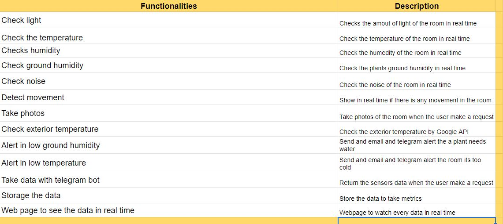
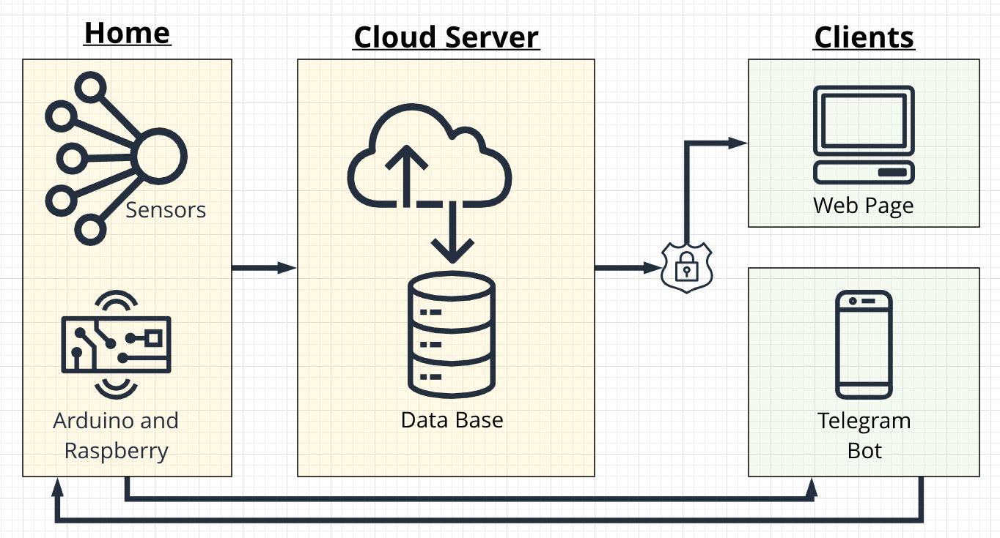
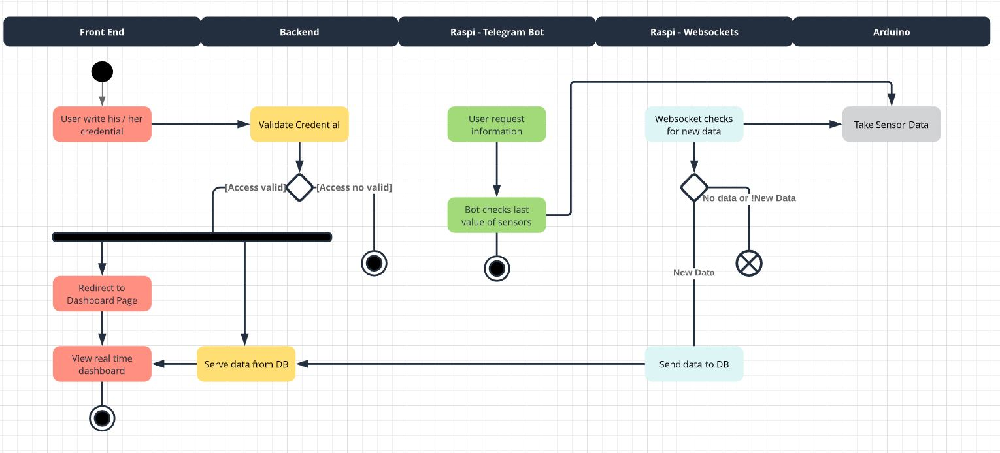
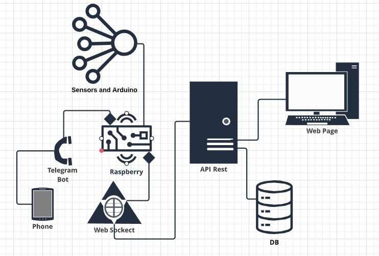

# Home System Project 🚀

## Description

Hi! Welcome! This is the repository for the DOCs of [Home System Project](https://github.com/users/albertumus/projects/1). Here you can find everything you need to build a similar system
and also for me, the dev, its important to have a base documents to build a great software. 

###### Remember, cool kids write docs!

##### System Desc: 
The idea its to connect few sensor to and Arduino at home. The Arduino will be connected to WIFI by and ESP82 module. A websocket located in the raspberry will be checking new values from the arduino and sending them to an API Rest localited in Herouk. The front end will be display in Herouk too and will request the information from the API Rest. Also, a telegram bot will be deploy in raspberry and use by the users to get real time data. 

I know that maybe this is a quite strange architecture and it can be simplified, but the main goal of this project its to learn and train tech skills. 

This project isn't a business case or company project, this is a personal ( and tried of professional ) project. Its created to learn new stuff about API Rest, Websockets, arduino...etc and most important HAVE FUN. Anyway, if you have any critic to the project or code, please, let me know! :) 

## Project Technologies

Here is the list of technologies used in the project, but you can use any other framework or language: 

  - [Sensors and Arduino](https://www.arduino.cc/): Arduino and differents sensors. List in the DOCs
  - [Local Server](https://www.raspberrypi.org/): Raspberry Pi
  - [Websockets](https://websockets.readthedocs.io/en/stable/intro.html): Python 
  - [Telegram Bot](https://core.telegram.org/bots): Python
  - [API Rest](https://www.django-rest-framework.org/): Python and Django Rest Framwork.
  - [Front End Page](https://angular.io/): Typescript and Angular 2.8

## Elements Needed 

Here is the list of real world elements needed to make this real 

## 1. Funcionalities

## 2. Map System

## 3. Workflow and User Interaction

## 3. Software Architecture

## 4. Link to Project Documentation
